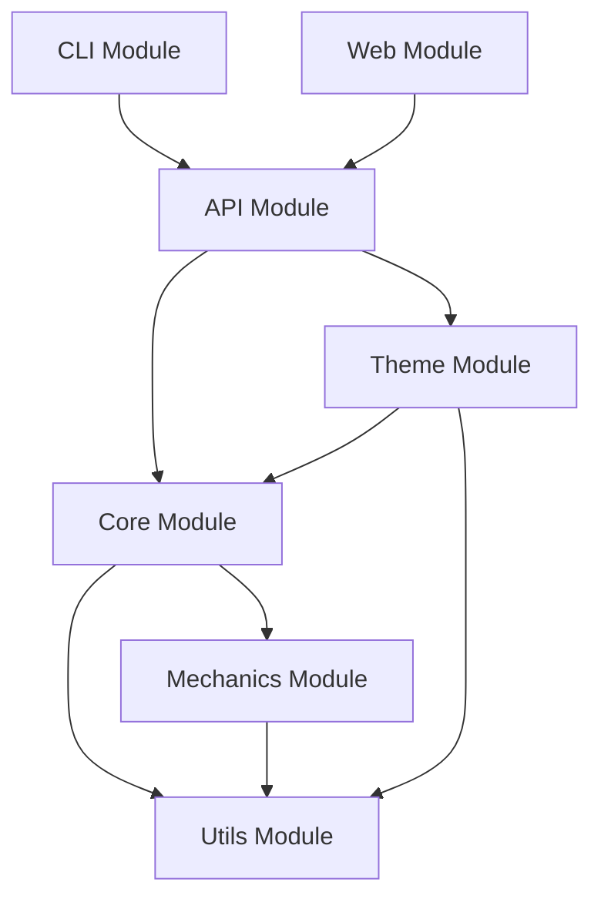

# Integration Architecture Specification
## Battle Automata Engine

**Version:** 1.0
**Date:** 2025-11-14
**Status:** Draft

---

## Table of Contents

1. [Overview](#overview)
2. [Public API Interfaces](#public-api-interfaces)
3. [CLI Structure and Commands](#cli-structure-and-commands)
4. [Project Directory Layout](#project-directory-layout)
5. [Module Boundaries](#module-boundaries)
6. [Build and Test Infrastructure](#build-and-test-infrastructure)
7. [Data Formats and Schemas](#data-formats-and-schemas)
8. [Integration Patterns](#integration-patterns)
9. [Deployment and Distribution](#deployment-and-distribution)

---

## Overview

### Architecture Principles

1. **Theme Agnostic**: Core engine independent of visual themes
2. **Data Driven**: All game content in JSON/YAML files
3. **Deterministic**: Same inputs always produce same outputs
4. **Modular**: Clear separation of concerns
5. **Extensible**: Easy to add new components and mechanics
6. **Testable**: Comprehensive test coverage

### Technology Stack

**Primary Implementation: Python 3.10+**
- **Language**: Python 3.10+ with type hints
- **Data Format**: YAML (primary), JSON (supported)
- **Schema Validation**: Pydantic v2
- **CLI Framework**: Click 8.x
- **Testing**: pytest + pytest-cov
- **Build**: setuptools with pyproject.toml
- **Documentation**: Sphinx + autodoc

**Alternative Implementation: TypeScript/Node.js**
- **Language**: TypeScript 5.x
- **Runtime**: Node.js 18+
- **Schema Validation**: Zod
- **CLI Framework**: Commander.js
- **Testing**: Jest + ts-jest
- **Build**: tsup or esbuild

---

## Public API Interfaces

### Core API Modules

#### 1. Component API

```python
# battle_automata/api/component.py

from typing import Dict, Any, List, Optional
from pydantic import BaseModel
from enum import Enum

class ComponentType(Enum):
    """Component category types"""
    OFFENSIVE = "offensive"
    DEFENSIVE = "defensive"
    MOBILITY = "mobility"
    SUPPORT = "support"

class ComponentStats(BaseModel):
    """Component statistical properties"""
    damage: Optional[int] = None
    armor: Optional[int] = None
    range: Optional[int] = None
    speed: Optional[int] = None
    fire_rate: Optional[float] = None
    accuracy: Optional[float] = None

class ComponentResources(BaseModel):
    """Resource costs and requirements"""
    power_draw: int
    weight: int
    slots: int = 1

class Component(BaseModel):
    """Base component definition"""
    id: str
    name: str
    type: ComponentType
    category: str
    stats: ComponentStats
    resources: ComponentResources
    special: Dict[str, Any] = {}

    def validate(self) -> bool:
        """Validate component data integrity"""
        pass

    def to_dict(self) -> Dict[str, Any]:
        """Serialize to dictionary"""
        pass

    @classmethod
    def from_dict(cls, data: Dict[str, Any]) -> 'Component':
        """Deserialize from dictionary"""
        pass

    @classmethod
    def from_file(cls, filepath: str) -> 'Component':
        """Load from YAML/JSON file"""
        pass

class ComponentRegistry:
    """Registry for managing components"""

    def __init__(self):
        self._components: Dict[str, Component] = {}

    def register(self, component: Component) -> None:
        """Register a component"""
        pass

    def get(self, component_id: str) -> Optional[Component]:
        """Get component by ID"""
        pass

    def list(self,
             type: Optional[ComponentType] = None,
             category: Optional[str] = None) -> List[Component]:
        """List components with optional filtering"""
        pass

    def load_from_directory(self, directory: str) -> int:
        """Load all components from directory"""
        pass
```

#### 2. Unit API

```python
# battle_automata/api/unit.py

from typing import List, Dict, Tuple, Optional
from pydantic import BaseModel
from .component import Component

class ComponentPlacement(BaseModel):
    """Component placement on unit"""
    component_id: str
    position: Tuple[int, int]
    facing: str = "forward"  # forward, rear, left, right

class UnitLayout(BaseModel):
    """Unit layout configuration"""
    size: Tuple[int, int]
    origin: Tuple[int, int] = (0, 0)

class UnitResources(BaseModel):
    """Unit resource limits"""
    power: int
    weight_limit: int
    slot_limit: int

class Unit(BaseModel):
    """Battle unit composed of components"""
    id: str
    name: str
    theme: str
    layout: UnitLayout
    components: List[ComponentPlacement]
    resources: UnitResources
    metadata: Dict[str, Any] = {}

    def validate(self) -> Tuple[bool, List[str]]:
        """Validate unit configuration

        Returns:
            Tuple of (is_valid, error_messages)
        """
        pass

    def get_total_stats(self) -> Dict[str, float]:
        """Calculate aggregate unit statistics"""
        pass

    def get_component(self, position: Tuple[int, int]) -> Optional[Component]:
        """Get component at position"""
        pass

    @classmethod
    def from_file(cls, filepath: str) -> 'Unit':
        """Load from YAML/JSON file"""
        pass

    def to_file(self, filepath: str) -> None:
        """Save to YAML/JSON file"""
        pass

class UnitBuilder:
    """Fluent API for building units"""

    def __init__(self, name: str, theme: str):
        self._unit: Unit = None

    def with_layout(self, size: Tuple[int, int]) -> 'UnitBuilder':
        """Set unit layout"""
        pass

    def with_resources(self, power: int, weight: int, slots: int) -> 'UnitBuilder':
        """Set resource limits"""
        pass

    def add_component(self,
                     component_id: str,
                     position: Tuple[int, int],
                     facing: str = "forward") -> 'UnitBuilder':
        """Add component to unit"""
        pass

    def build(self) -> Unit:
        """Build and validate unit"""
        pass
```

#### 3. Battle API

```python
# battle_automata/api/battle.py

from typing import List, Dict, Any, Optional, Callable
from pydantic import BaseModel
from enum import Enum
from .unit import Unit

class BattleOutcome(Enum):
    """Battle result outcomes"""
    UNIT1_VICTORY = "unit1_victory"
    UNIT2_VICTORY = "unit2_victory"
    DRAW = "draw"
    TIMEOUT = "timeout"

class BattleConfig(BaseModel):
    """Battle configuration"""
    arena_size: Tuple[int, int] = (100, 100)
    time_step: float = 0.1  # seconds
    max_duration: float = 300.0  # seconds
    seed: Optional[int] = None

class BattleEvent(BaseModel):
    """Single battle event"""
    timestamp: float
    event_type: str
    actor: str
    target: Optional[str] = None
    data: Dict[str, Any] = {}

class BattleResult(BaseModel):
    """Battle simulation result"""
    outcome: BattleOutcome
    winner: Optional[str]
    duration: float
    total_turns: int
    events: List[BattleEvent]
    unit1_damage_dealt: int
    unit2_damage_dealt: int
    unit1_damage_taken: int
    unit2_damage_taken: int

    def to_summary(self) -> str:
        """Generate human-readable summary"""
        pass

    def to_json(self, filepath: str) -> None:
        """Export to JSON file"""
        pass

class Battle:
    """Battle simulation engine"""

    def __init__(self,
                 unit1: Unit,
                 unit2: Unit,
                 config: Optional[BattleConfig] = None):
        self.unit1 = unit1
        self.unit2 = unit2
        self.config = config or BattleConfig()
        self._state: Dict[str, Any] = {}
        self._events: List[BattleEvent] = []

    def simulate(self) -> BattleResult:
        """Run complete battle simulation

        Returns:
            BattleResult with complete battle history
        """
        pass

    def step(self) -> bool:
        """Execute single simulation step

        Returns:
            True if battle continues, False if finished
        """
        pass

    def get_state(self) -> Dict[str, Any]:
        """Get current battle state snapshot"""
        pass

    def add_observer(self, callback: Callable[[BattleEvent], None]) -> None:
        """Add event observer for real-time updates"""
        pass

    @classmethod
    def from_config_file(cls, filepath: str) -> 'Battle':
        """Load battle from configuration file"""
        pass

class BattleSimulator:
    """High-level battle simulation interface"""

    @staticmethod
    def quick_battle(unit1_path: str,
                     unit2_path: str,
                     seed: Optional[int] = None) -> BattleResult:
        """Run quick battle from unit files"""
        pass

    @staticmethod
    def tournament(units: List[str],
                  rounds: int = 1) -> List[BattleResult]:
        """Run round-robin tournament"""
        pass

    @staticmethod
    def replay(battle_log: str) -> BattleResult:
        """Replay battle from event log"""
        pass
```

#### 4. Theme API

```python
# battle_automata/api/theme.py

from typing import Dict, List, Optional
from pydantic import BaseModel
from pathlib import Path

class ThemeMetadata(BaseModel):
    """Theme metadata and configuration"""
    id: str
    name: str
    version: str
    description: str
    author: str
    tags: List[str] = []

class Theme:
    """Theme management and loading"""

    def __init__(self, theme_path: str):
        self.path = Path(theme_path)
        self.metadata: ThemeMetadata = None
        self._components: Dict[str, Component] = {}
        self._units: Dict[str, Unit] = {}

    def load(self) -> None:
        """Load theme data"""
        pass

    def get_component(self, component_id: str) -> Optional[Component]:
        """Get component from theme"""
        pass

    def get_unit(self, unit_id: str) -> Optional[Unit]:
        """Get preset unit from theme"""
        pass

    def list_components(self, category: Optional[str] = None) -> List[str]:
        """List available components"""
        pass

    def list_units(self) -> List[str]:
        """List preset units"""
        pass

    def validate(self) -> Tuple[bool, List[str]]:
        """Validate theme integrity"""
        pass

class ThemeManager:
    """Manage multiple themes"""

    def __init__(self, themes_directory: str):
        self.themes_dir = Path(themes_directory)
        self._themes: Dict[str, Theme] = {}

    def discover(self) -> List[str]:
        """Discover available themes"""
        pass

    def load_theme(self, theme_id: str) -> Theme:
        """Load specific theme"""
        pass

    def get_active_theme(self) -> Optional[Theme]:
        """Get currently active theme"""
        pass

    def set_active_theme(self, theme_id: str) -> None:
        """Set active theme"""
        pass
```

#### 5. Engine API

```python
# battle_automata/api/engine.py

from typing import Optional, Dict, Any
from pathlib import Path

class Engine:
    """Main engine facade for easy integration"""

    def __init__(self, data_directory: Optional[str] = None):
        self.data_dir = Path(data_directory or "./data")
        self.theme_manager: ThemeManager = None
        self.component_registry: ComponentRegistry = None
        self._initialized = False

    def initialize(self) -> None:
        """Initialize engine and load data"""
        pass

    def load_theme(self, theme_id: str) -> Theme:
        """Load a theme"""
        pass

    def create_unit(self, name: str) -> UnitBuilder:
        """Create new unit with builder"""
        pass

    def load_unit(self, filepath: str) -> Unit:
        """Load unit from file"""
        pass

    def create_battle(self,
                     unit1: Unit,
                     unit2: Unit,
                     config: Optional[BattleConfig] = None) -> Battle:
        """Create battle instance"""
        pass

    def simulate_battle(self,
                       unit1_path: str,
                       unit2_path: str,
                       seed: Optional[int] = None) -> BattleResult:
        """Convenience method for quick battles"""
        pass

    def get_config(self) -> Dict[str, Any]:
        """Get engine configuration"""
        pass

    def set_config(self, config: Dict[str, Any]) -> None:
        """Update engine configuration"""
        pass

# Convenience singleton instance
engine = Engine()

def initialize(data_directory: Optional[str] = None) -> Engine:
    """Initialize global engine instance"""
    global engine
    engine = Engine(data_directory)
    engine.initialize()
    return engine

def get_engine() -> Engine:
    """Get global engine instance"""
    return engine
```

---

## CLI Structure and Commands

### Command Hierarchy

```
battle-sim
├── init              # Initialize new project
├── theme             # Theme management
│   ├── list          # List available themes
│   ├── info          # Show theme details
│   └── validate      # Validate theme
├── component         # Component operations
│   ├── list          # List components
│   ├── show          # Show component details
│   ├── create        # Create component template
│   └── validate      # Validate component
├── unit              # Unit operations
│   ├── list          # List units
│   ├── show          # Show unit details
│   ├── create        # Create unit interactively
│   ├── edit          # Edit unit
│   ├── validate      # Validate unit
│   └── export        # Export unit
├── battle            # Battle simulation
│   ├── simulate      # Run battle
│   ├── tournament    # Run tournament
│   ├── replay        # Replay battle
│   └── analyze       # Analyze results
├── server            # Development server
│   └── start         # Start web server
└── config            # Configuration
    ├── show          # Show current config
    └── set           # Update config
```

### CLI Implementation (Python)

```python
# battle_automata/cli/main.py

import click
from pathlib import Path
from typing import Optional

@click.group()
@click.version_option(version="0.1.0")
@click.option('--data-dir',
              type=click.Path(exists=True),
              help='Data directory path')
@click.pass_context
def cli(ctx, data_dir: Optional[str]):
    """Battle Automata Engine - Theme-agnostic battle simulation

    Build combat units from modular components and simulate
    deterministic battles between automata.
    """
    ctx.ensure_object(dict)
    ctx.obj['data_dir'] = data_dir or './data'

# ============================================================================
# INIT COMMANDS
# ============================================================================

@cli.command()
@click.option('--theme',
              default='space-ships',
              help='Initial theme to create')
@click.option('--name',
              prompt='Project name',
              help='Project name')
@click.argument('directory',
                type=click.Path(),
                default='.')
def init(theme: str, name: str, directory: str):
    """Initialize new Battle Automata project

    Creates project structure with example theme.

    Example:
        battle-sim init --theme space-ships --name "My Battle Game"
    """
    click.echo(f"Initializing project: {name}")
    # Implementation

# ============================================================================
# THEME COMMANDS
# ============================================================================

@cli.group()
def theme():
    """Manage themes"""
    pass

@theme.command('list')
@click.pass_context
def theme_list(ctx):
    """List available themes

    Example:
        battle-sim theme list
    """
    # Implementation
    pass

@theme.command('info')
@click.argument('theme_id')
@click.pass_context
def theme_info(ctx, theme_id: str):
    """Show detailed theme information

    Example:
        battle-sim theme info space-ships
    """
    # Implementation
    pass

@theme.command('validate')
@click.argument('theme_path', type=click.Path(exists=True))
def theme_validate(theme_path: str):
    """Validate theme structure and data

    Example:
        battle-sim theme validate ./data/themes/space-ships
    """
    # Implementation
    pass

# ============================================================================
# COMPONENT COMMANDS
# ============================================================================

@cli.group()
def component():
    """Manage components"""
    pass

@component.command('list')
@click.option('--theme', help='Filter by theme')
@click.option('--type', help='Filter by type')
@click.option('--category', help='Filter by category')
@click.pass_context
def component_list(ctx, theme: Optional[str],
                   type: Optional[str],
                   category: Optional[str]):
    """List available components

    Example:
        battle-sim component list --type offensive
    """
    # Implementation
    pass

@component.command('show')
@click.argument('component_id')
@click.option('--theme', help='Theme context')
@click.pass_context
def component_show(ctx, component_id: str, theme: Optional[str]):
    """Show component details

    Example:
        battle-sim component show laser_cannon_mk1
    """
    # Implementation
    pass

@component.command('create')
@click.option('--theme', required=True, help='Target theme')
@click.option('--type',
              type=click.Choice(['offensive', 'defensive', 'mobility', 'support']),
              required=True,
              help='Component type')
@click.option('--template',
              type=click.Path(exists=True),
              help='Template file')
@click.argument('output', type=click.Path())
def component_create(theme: str, type: str,
                    template: Optional[str], output: str):
    """Create component template

    Example:
        battle-sim component create --theme space-ships --type offensive laser.yaml
    """
    # Implementation
    pass

@component.command('validate')
@click.argument('component_file', type=click.Path(exists=True))
def component_validate(component_file: str):
    """Validate component file

    Example:
        battle-sim component validate ./laser_cannon.yaml
    """
    # Implementation
    pass

# ============================================================================
# UNIT COMMANDS
# ============================================================================

@cli.group()
def unit():
    """Manage units"""
    pass

@unit.command('list')
@click.option('--theme', help='Filter by theme')
@click.pass_context
def unit_list(ctx, theme: Optional[str]):
    """List available units

    Example:
        battle-sim unit list --theme space-ships
    """
    # Implementation
    pass

@unit.command('show')
@click.argument('unit_id')
@click.option('--detail', is_flag=True, help='Show detailed stats')
@click.pass_context
def unit_show(ctx, unit_id: str, detail: bool):
    """Show unit details and statistics

    Example:
        battle-sim unit show fighter --detail
    """
    # Implementation
    pass

@unit.command('create')
@click.option('--theme', required=True, help='Theme to use')
@click.option('--interactive', is_flag=True, help='Interactive mode')
@click.argument('output', type=click.Path())
def unit_create(theme: str, interactive: bool, output: str):
    """Create new unit

    Example:
        battle-sim unit create --theme space-ships --interactive fighter.yaml
    """
    # Implementation
    pass

@unit.command('validate')
@click.argument('unit_file', type=click.Path(exists=True))
def unit_validate(unit_file: str):
    """Validate unit configuration

    Example:
        battle-sim unit validate ./fighter.yaml
    """
    # Implementation
    pass

@unit.command('export')
@click.argument('unit_file', type=click.Path(exists=True))
@click.option('--format',
              type=click.Choice(['json', 'yaml', 'markdown']),
              default='json')
@click.argument('output', type=click.Path())
def unit_export(unit_file: str, format: str, output: str):
    """Export unit in different format

    Example:
        battle-sim unit export fighter.yaml --format json fighter.json
    """
    # Implementation
    pass

# ============================================================================
# BATTLE COMMANDS
# ============================================================================

@cli.group()
def battle():
    """Battle simulation"""
    pass

@battle.command('simulate')
@click.argument('unit1', type=click.Path(exists=True))
@click.argument('unit2', type=click.Path(exists=True))
@click.option('--seed', type=int, help='Random seed for determinism')
@click.option('--output', type=click.Path(), help='Save results to file')
@click.option('--verbose', is_flag=True, help='Detailed output')
@click.option('--watch', is_flag=True, help='Real-time updates')
def battle_simulate(unit1: str, unit2: str,
                   seed: Optional[int],
                   output: Optional[str],
                   verbose: bool,
                   watch: bool):
    """Simulate battle between two units

    Example:
        battle-sim battle simulate fighter.yaml tank.yaml --seed 12345
    """
    # Implementation
    pass

@battle.command('tournament')
@click.argument('units', nargs=-1, type=click.Path(exists=True))
@click.option('--rounds', type=int, default=1, help='Rounds per matchup')
@click.option('--output', type=click.Path(), help='Results output file')
@click.option('--format',
              type=click.Choice(['table', 'json', 'csv']),
              default='table')
def battle_tournament(units: List[str],
                     rounds: int,
                     output: Optional[str],
                     format: str):
    """Run round-robin tournament

    Example:
        battle-sim battle tournament fighter.yaml tank.yaml bomber.yaml --rounds 3
    """
    # Implementation
    pass

@battle.command('replay')
@click.argument('battle_log', type=click.Path(exists=True))
@click.option('--speed', type=float, default=1.0, help='Playback speed')
@click.option('--start', type=float, help='Start time')
@click.option('--end', type=float, help='End time')
def battle_replay(battle_log: str,
                 speed: float,
                 start: Optional[float],
                 end: Optional[float]):
    """Replay battle from log file

    Example:
        battle-sim battle replay battle_001.json --speed 2.0
    """
    # Implementation
    pass

@battle.command('analyze')
@click.argument('battle_log', type=click.Path(exists=True))
@click.option('--metric',
              type=click.Choice(['damage', 'efficiency', 'timeline']),
              help='Analysis metric')
def battle_analyze(battle_log: str, metric: Optional[str]):
    """Analyze battle results

    Example:
        battle-sim battle analyze battle_001.json --metric damage
    """
    # Implementation
    pass

# ============================================================================
# SERVER COMMANDS
# ============================================================================

@cli.group()
def server():
    """Development server"""
    pass

@server.command('start')
@click.option('--host', default='127.0.0.1', help='Server host')
@click.option('--port', type=int, default=8000, help='Server port')
@click.option('--reload', is_flag=True, help='Auto-reload on changes')
@click.pass_context
def server_start(ctx, host: str, port: int, reload: bool):
    """Start development web server

    Example:
        battle-sim server start --port 8080 --reload
    """
    # Implementation
    pass

# ============================================================================
# CONFIG COMMANDS
# ============================================================================

@cli.group()
def config():
    """Configuration management"""
    pass

@config.command('show')
@click.option('--key', help='Specific config key')
def config_show(key: Optional[str]):
    """Show current configuration

    Example:
        battle-sim config show
        battle-sim config show --key theme.active
    """
    # Implementation
    pass

@config.command('set')
@click.argument('key')
@click.argument('value')
def config_set(key: str, value: str):
    """Set configuration value

    Example:
        battle-sim config set theme.active space-ships
    """
    # Implementation
    pass

if __name__ == '__main__':
    cli()
```

### Usage Examples

```bash
# Initialize new project
battle-sim init --theme space-ships --name "Star Combat"

# List components
battle-sim component list --type offensive

# Create a unit
battle-sim unit create --theme space-ships fighter.yaml

# Validate unit
battle-sim unit validate fighter.yaml

# Simulate battle
battle-sim battle simulate fighter.yaml tank.yaml --seed 12345

# Run tournament
battle-sim battle tournament unit1.yaml unit2.yaml unit3.yaml --rounds 5

# Replay battle
battle-sim battle replay battle_log.json

# Start dev server
battle-sim server start --port 8080 --reload
```

---

## Project Directory Layout

### Complete Directory Structure

```
better-space-arena/
│
├── .github/                      # GitHub configuration
│   ├── workflows/
│   │   ├── ci.yml               # Continuous integration
│   │   ├── release.yml          # Release automation
│   │   └── docs.yml             # Documentation building
│   └── ISSUE_TEMPLATE/
│
├── .claude/                      # Claude AI agent definitions
│   └── commands/
│       ├── orchestrator.md
│       ├── architect.md
│       └── ...
│
├── src/                          # Source code root
│   └── battle_automata/         # Main package
│       │
│       ├── __init__.py          # Package initialization
│       ├── __main__.py          # CLI entry point
│       ├── version.py           # Version information
│       │
│       ├── api/                 # Public API interfaces
│       │   ├── __init__.py
│       │   ├── component.py
│       │   ├── unit.py
│       │   ├── battle.py
│       │   ├── theme.py
│       │   └── engine.py
│       │
│       ├── core/                # Core engine logic
│       │   ├── __init__.py
│       │   ├── component.py     # Component system
│       │   ├── unit.py          # Unit management
│       │   ├── battle.py        # Battle orchestration
│       │   ├── engine.py        # Simulation engine
│       │   └── state.py         # State management
│       │
│       ├── mechanics/           # Combat mechanics
│       │   ├── __init__.py
│       │   ├── movement.py      # Movement system
│       │   ├── targeting.py     # Targeting logic
│       │   ├── damage.py        # Damage calculation
│       │   ├── effects.py       # Status effects
│       │   ├── collision.py     # Collision detection
│       │   └── physics.py       # Physics simulation
│       │
│       ├── utils/               # Utilities
│       │   ├── __init__.py
│       │   ├── loader.py        # Data loading
│       │   ├── validator.py     # Schema validation
│       │   ├── logger.py        # Event logging
│       │   ├── serializer.py    # Serialization
│       │   ├── random.py        # Deterministic RNG
│       │   └── geometry.py      # Geometric utilities
│       │
│       ├── cli/                 # Command-line interface
│       │   ├── __init__.py
│       │   ├── main.py          # Main CLI entry
│       │   ├── commands/        # Command implementations
│       │   │   ├── __init__.py
│       │   │   ├── init.py
│       │   │   ├── theme.py
│       │   │   ├── component.py
│       │   │   ├── unit.py
│       │   │   ├── battle.py
│       │   │   ├── server.py
│       │   │   └── config.py
│       │   └── ui/              # UI utilities
│       │       ├── __init__.py
│       │       ├── formatting.py
│       │       ├── progress.py
│       │       └── tables.py
│       │
│       ├── web/                 # Web server (optional)
│       │   ├── __init__.py
│       │   ├── app.py           # FastAPI/Flask app
│       │   ├── routes/
│       │   │   ├── __init__.py
│       │   │   ├── api.py
│       │   │   └── websocket.py
│       │   ├── static/
│       │   └── templates/
│       │
│       └── schemas/             # JSON/YAML schemas
│           ├── component.json
│           ├── unit.json
│           ├── battle.json
│           └── theme.json
│
├── data/                        # Game data
│   ├── config/                  # Engine configuration
│   │   └── engine.yaml
│   │
│   └── themes/                  # Theme directory
│       │
│       ├── space-ships/         # Example theme
│       │   ├── theme.yaml       # Theme metadata
│       │   │
│       │   ├── components/      # Component definitions
│       │   │   ├── offensive/
│       │   │   │   ├── laser_cannon_mk1.yaml
│       │   │   │   ├── missile_launcher.yaml
│       │   │   │   └── ...
│       │   │   ├── defensive/
│       │   │   │   ├── armor_plate.yaml
│       │   │   │   ├── shield_generator.yaml
│       │   │   │   └── ...
│       │   │   ├── mobility/
│       │   │   │   ├── engine_basic.yaml
│       │   │   │   ├── thruster.yaml
│       │   │   │   └── ...
│       │   │   └── support/
│       │   │       ├── power_generator.yaml
│       │   │       ├── sensor_array.yaml
│       │   │       └── ...
│       │   │
│       │   └── units/           # Preset units
│       │       ├── fighter.yaml
│       │       ├── tank.yaml
│       │       ├── bomber.yaml
│       │       └── ...
│       │
│       └── mechs/               # Alternative theme
│           └── ...
│
├── tests/                       # Test suite
│   ├── __init__.py
│   ├── conftest.py             # Pytest configuration
│   │
│   ├── unit/                   # Unit tests
│   │   ├── __init__.py
│   │   ├── test_component.py
│   │   ├── test_unit.py
│   │   ├── test_battle.py
│   │   ├── test_mechanics.py
│   │   └── test_utils.py
│   │
│   ├── integration/            # Integration tests
│   │   ├── __init__.py
│   │   ├── test_api.py
│   │   ├── test_cli.py
│   │   ├── test_theme_loading.py
│   │   └── test_battle_flow.py
│   │
│   ├── e2e/                    # End-to-end tests
│   │   ├── __init__.py
│   │   ├── test_full_battle.py
│   │   └── test_determinism.py
│   │
│   └── fixtures/               # Test fixtures
│       ├── components/
│       ├── units/
│       └── battles/
│
├── docs/                        # Documentation
│   ├── index.md                # Documentation home
│   ├── getting-started.md      # Getting started guide
│   ├── user-guide/             # User documentation
│   │   ├── installation.md
│   │   ├── quick-start.md
│   │   ├── components.md
│   │   ├── units.md
│   │   ├── battles.md
│   │   └── themes.md
│   ├── developer-guide/        # Developer documentation
│   │   ├── architecture.md
│   │   ├── api-reference.md
│   │   ├── extending.md
│   │   ├── contributing.md
│   │   └── testing.md
│   ├── api/                    # API documentation
│   │   ├── component.md
│   │   ├── unit.md
│   │   ├── battle.md
│   │   └── engine.md
│   ├── agentic-patterns/       # AI agent documentation
│   │   ├── AGENTIC_PATTERNS.md
│   │   └── WHEN_TO_USE_WHAT.md
│   └── INTEGRATION_ARCHITECTURE.md  # This file
│
├── examples/                    # Example code
│   ├── simple_battle.py        # Basic battle example
│   ├── custom_component.py     # Custom component
│   ├── unit_builder.py         # Unit building
│   ├── tournament.py           # Tournament
│   └── theme_creator.py        # Theme creation
│
├── scripts/                     # Development scripts
│   ├── setup.sh                # Setup script
│   ├── test.sh                 # Test runner
│   ├── build.sh                # Build script
│   ├── lint.sh                 # Linting
│   └── release.sh              # Release automation
│
├── benchmarks/                  # Performance benchmarks
│   ├── __init__.py
│   ├── benchmark_simulation.py
│   └── benchmark_loading.py
│
├── .gitignore                   # Git ignore rules
├── .gitattributes              # Git attributes
├── .editorconfig               # Editor configuration
├── .pre-commit-config.yaml     # Pre-commit hooks
│
├── pyproject.toml              # Python project config
├── setup.py                    # Setup script (legacy)
├── setup.cfg                   # Setup configuration
├── requirements.txt            # Production dependencies
├── requirements-dev.txt        # Development dependencies
├── requirements-test.txt       # Test dependencies
│
├── Dockerfile                  # Docker image
├── docker-compose.yml          # Docker Compose
├── .dockerignore               # Docker ignore
│
├── Makefile                    # Make commands
├── justfile                    # Just commands (alternative)
│
├── README.md                   # Project readme
├── CHANGELOG.md                # Change log
├── LICENSE                     # License file
├── CONTRIBUTING.md             # Contributing guide
└── CODE_OF_CONDUCT.md         # Code of conduct
```

### Key Directory Purposes

| Directory | Purpose | Access Level |
|-----------|---------|-------------|
| `src/battle_automata/api/` | Public API interfaces | **PUBLIC** |
| `src/battle_automata/core/` | Core implementation | Internal |
| `src/battle_automata/mechanics/` | Game mechanics | Internal |
| `src/battle_automata/utils/` | Utilities | Internal |
| `src/battle_automata/cli/` | CLI implementation | **PUBLIC** (via commands) |
| `data/themes/` | Game data | **USER FACING** |
| `tests/` | Test suite | Development |
| `docs/` | Documentation | **PUBLIC** |
| `examples/` | Example code | **PUBLIC** |

---

## Module Boundaries

### Architecture Layers

```
┌─────────────────────────────────────────────────┐
│                 CLI / Web API                    │  ← User Interface Layer
├─────────────────────────────────────────────────┤
│                 Public API                       │  ← Integration Layer
├─────────────────────────────────────────────────┤
│                 Core Engine                      │  ← Business Logic Layer
├─────────────────────────────────────────────────┤
│                 Mechanics                        │  ← Domain Logic Layer
├─────────────────────────────────────────────────┤
│                 Utilities                        │  ← Infrastructure Layer
└─────────────────────────────────────────────────┘
```

### Module Dependencies



### Dependency Rules

1. **No Circular Dependencies**: Modules must form a DAG
2. **Interface Segregation**: Public API separate from implementation
3. **Dependency Inversion**: Depend on abstractions, not concretions
4. **Single Responsibility**: Each module has one clear purpose

### Module Contracts

#### 1. API Module Contract

**Exports:**
- `Component`, `ComponentRegistry`
- `Unit`, `UnitBuilder`
- `Battle`, `BattleSimulator`, `BattleResult`
- `Theme`, `ThemeManager`
- `Engine`, `initialize()`, `get_engine()`

**Depends On:**
- `core` (implementation)
- `utils` (serialization, validation)

**Guarantees:**
- Stable public interface (semantic versioning)
- Type-safe operations (Pydantic models)
- Comprehensive documentation

#### 2. Core Module Contract

**Exports:**
- Implementation classes for API
- State management
- Engine orchestration

**Depends On:**
- `mechanics` (combat logic)
- `utils` (infrastructure)

**Guarantees:**
- Deterministic behavior
- Thread-safe operations
- Complete event logging

#### 3. Mechanics Module Contract

**Exports:**
- Movement system
- Targeting system
- Damage calculation
- Effect application

**Depends On:**
- `utils` (geometry, random)

**Guarantees:**
- Deterministic with seeded RNG
- Stateless functions where possible
- Performance optimized

#### 4. Utils Module Contract

**Exports:**
- Data loading and validation
- Serialization utilities
- Logging infrastructure
- Random number generation
- Geometry helpers

**Depends On:**
- Standard library only
- External dependencies (pydantic, pyyaml)

**Guarantees:**
- No business logic
- Pure utility functions
- Comprehensive error handling

### Import Guidelines

```python
# ✅ GOOD: Import from API layer
from battle_automata.api import Engine, Unit, Battle

# ✅ GOOD: Import specific submodules
from battle_automata.core.component import ComponentImpl
from battle_automata.mechanics.damage import calculate_damage

# ❌ BAD: Skip API layer from external code
from battle_automata.core.battle import BattleEngine  # Internal!

# ❌ BAD: Circular imports
# In core/component.py
from battle_automata.core.unit import Unit  # If unit imports component

# ✅ GOOD: Use TYPE_CHECKING for type hints
from typing import TYPE_CHECKING
if TYPE_CHECKING:
    from battle_automata.core.unit import Unit
```

---

## Build and Test Infrastructure

### Build Configuration (Python)

#### pyproject.toml

```toml
[build-system]
requires = ["setuptools>=65.0", "wheel"]
build-backend = "setuptools.build_meta"

[project]
name = "battle-automata"
version = "0.1.0"
description = "Theme-agnostic engine for deterministic battle simulation"
authors = [
    {name = "Your Name", email = "your.email@example.com"}
]
readme = "README.md"
requires-python = ">=3.10"
license = {text = "MIT"}
keywords = ["game", "simulation", "battle", "automata", "engine"]
classifiers = [
    "Development Status :: 3 - Alpha",
    "Intended Audience :: Developers",
    "License :: OSI Approved :: MIT License",
    "Programming Language :: Python :: 3.10",
    "Programming Language :: Python :: 3.11",
    "Programming Language :: Python :: 3.12",
    "Topic :: Games/Entertainment :: Simulation",
]

dependencies = [
    "pydantic>=2.0.0",
    "pyyaml>=6.0",
    "click>=8.1.0",
    "rich>=13.0.0",
    "numpy>=1.24.0",
]

[project.optional-dependencies]
dev = [
    "pytest>=7.4.0",
    "pytest-cov>=4.1.0",
    "pytest-mock>=3.11.0",
    "pytest-asyncio>=0.21.0",
    "black>=23.0.0",
    "isort>=5.12.0",
    "flake8>=6.0.0",
    "mypy>=1.4.0",
    "pre-commit>=3.3.0",
]

web = [
    "fastapi>=0.100.0",
    "uvicorn[standard]>=0.23.0",
    "websockets>=11.0",
]

docs = [
    "mkdocs>=1.5.0",
    "mkdocs-material>=9.1.0",
    "mkdocstrings[python]>=0.22.0",
]

[project.scripts]
battle-sim = "battle_automata.cli.main:cli"

[project.urls]
Homepage = "https://github.com/yourusername/battle-automata"
Documentation = "https://battle-automata.readthedocs.io"
Repository = "https://github.com/yourusername/battle-automata"
"Bug Tracker" = "https://github.com/yourusername/battle-automata/issues"

[tool.setuptools]
package-dir = {"" = "src"}

[tool.setuptools.packages.find]
where = ["src"]
include = ["battle_automata*"]

[tool.setuptools.package-data]
battle_automata = ["schemas/*.json", "web/static/*", "web/templates/*"]

# ============================================================================
# TESTING
# ============================================================================

[tool.pytest.ini_options]
testpaths = ["tests"]
python_files = ["test_*.py"]
python_classes = ["Test*"]
python_functions = ["test_*"]
addopts = [
    "--cov=battle_automata",
    "--cov-report=html",
    "--cov-report=term-missing",
    "--cov-report=xml",
    "--strict-markers",
    "--tb=short",
]
markers = [
    "slow: marks tests as slow (deselect with '-m \"not slow\"')",
    "integration: marks tests as integration tests",
    "e2e: marks tests as end-to-end tests",
]

[tool.coverage.run]
source = ["src"]
omit = [
    "*/tests/*",
    "*/test_*.py",
    "*/__pycache__/*",
]

[tool.coverage.report]
exclude_lines = [
    "pragma: no cover",
    "def __repr__",
    "raise AssertionError",
    "raise NotImplementedError",
    "if __name__ == .__main__.:",
    "if TYPE_CHECKING:",
    "@abstractmethod",
]

# ============================================================================
# CODE QUALITY
# ============================================================================

[tool.black]
line-length = 88
target-version = ["py310", "py311", "py312"]
include = '\.pyi?$'
exclude = '''
/(
    \.git
  | \.venv
  | \.tox
  | build
  | dist
)/
'''

[tool.isort]
profile = "black"
line_length = 88
multi_line_output = 3
include_trailing_comma = true
force_grid_wrap = 0
use_parentheses = true
ensure_newline_before_comments = true

[tool.mypy]
python_version = "3.10"
warn_return_any = true
warn_unused_configs = true
disallow_untyped_defs = true
disallow_incomplete_defs = true
check_untyped_defs = true
no_implicit_optional = true
warn_redundant_casts = true
warn_unused_ignores = true
warn_no_return = true
strict_equality = true

[[tool.mypy.overrides]]
module = "tests.*"
disallow_untyped_defs = false

# ============================================================================
# RUFF (Alternative to flake8/black/isort)
# ============================================================================

[tool.ruff]
line-length = 88
target-version = "py310"
select = ["E", "F", "W", "I", "N", "UP", "B", "A", "C4", "T20"]
ignore = ["E501"]  # Line too long (handled by black)

[tool.ruff.per-file-ignores]
"__init__.py" = ["F401"]  # Unused imports
```

### Makefile

```makefile
.PHONY: help install install-dev test lint format clean build docs

# Default target
.DEFAULT_GOAL := help

# Colors for output
BLUE := \033[0;34m
GREEN := \033[0;32m
RESET := \033[0m

help: ## Show this help message
	@echo "$(BLUE)Battle Automata Engine - Make Commands$(RESET)"
	@echo ""
	@grep -E '^[a-zA-Z_-]+:.*?## .*$$' $(MAKEFILE_LIST) | \
		awk 'BEGIN {FS = ":.*?## "}; {printf "  $(GREEN)%-20s$(RESET) %s\n", $$1, $$2}'

# ============================================================================
# INSTALLATION
# ============================================================================

install: ## Install package
	pip install -e .

install-dev: ## Install with development dependencies
	pip install -e ".[dev,web,docs]"
	pre-commit install

# ============================================================================
# TESTING
# ============================================================================

test: ## Run test suite
	pytest

test-unit: ## Run unit tests only
	pytest tests/unit/

test-integration: ## Run integration tests only
	pytest tests/integration/

test-e2e: ## Run end-to-end tests only
	pytest tests/e2e/

test-cov: ## Run tests with coverage report
	pytest --cov=battle_automata --cov-report=html --cov-report=term

test-watch: ## Run tests in watch mode
	pytest-watch

# ============================================================================
# CODE QUALITY
# ============================================================================

lint: ## Run linters
	flake8 src/ tests/
	mypy src/

format: ## Format code
	black src/ tests/
	isort src/ tests/

format-check: ## Check code formatting
	black --check src/ tests/
	isort --check-only src/ tests/

typecheck: ## Run type checker
	mypy src/

# ============================================================================
# BUILD
# ============================================================================

clean: ## Clean build artifacts
	rm -rf build/
	rm -rf dist/
	rm -rf *.egg-info
	rm -rf .pytest_cache
	rm -rf .coverage
	rm -rf htmlcov/
	find . -type d -name __pycache__ -exec rm -rf {} +
	find . -type f -name "*.pyc" -delete

build: clean ## Build distribution packages
	python -m build

publish-test: build ## Publish to Test PyPI
	python -m twine upload --repository testpypi dist/*

publish: build ## Publish to PyPI
	python -m twine upload dist/*

# ============================================================================
# DOCUMENTATION
# ============================================================================

docs: ## Build documentation
	cd docs && mkdocs build

docs-serve: ## Serve documentation locally
	cd docs && mkdocs serve

docs-deploy: ## Deploy documentation to GitHub Pages
	cd docs && mkdocs gh-deploy

# ============================================================================
# DEVELOPMENT
# ============================================================================

dev-server: ## Start development server
	battle-sim server start --reload

dev-init: ## Initialize development environment
	python scripts/setup.py --dev

dev-data: ## Generate sample data
	python scripts/generate_sample_data.py

# ============================================================================
# DOCKER
# ============================================================================

docker-build: ## Build Docker image
	docker build -t battle-automata:latest .

docker-run: ## Run Docker container
	docker-compose up

docker-test: ## Run tests in Docker
	docker-compose run --rm test

# ============================================================================
# BENCHMARKS
# ============================================================================

benchmark: ## Run performance benchmarks
	python -m pytest benchmarks/ --benchmark-only

benchmark-compare: ## Compare benchmark results
	python -m pytest benchmarks/ --benchmark-compare
```

### CI/CD Configuration

#### .github/workflows/ci.yml

```yaml
name: CI

on:
  push:
    branches: [ main, develop ]
  pull_request:
    branches: [ main, develop ]

jobs:
  lint:
    runs-on: ubuntu-latest
    steps:
      - uses: actions/checkout@v4

      - name: Set up Python
        uses: actions/setup-python@v4
        with:
          python-version: '3.10'

      - name: Install dependencies
        run: |
          pip install -e ".[dev]"

      - name: Run linters
        run: |
          black --check src/ tests/
          isort --check-only src/ tests/
          flake8 src/ tests/
          mypy src/

  test:
    runs-on: ${{ matrix.os }}
    strategy:
      matrix:
        os: [ubuntu-latest, macos-latest, windows-latest]
        python-version: ['3.10', '3.11', '3.12']

    steps:
      - uses: actions/checkout@v4

      - name: Set up Python ${{ matrix.python-version }}
        uses: actions/setup-python@v4
        with:
          python-version: ${{ matrix.python-version }}

      - name: Install dependencies
        run: |
          pip install -e ".[dev]"

      - name: Run tests
        run: |
          pytest --cov=battle_automata --cov-report=xml

      - name: Upload coverage
        uses: codecov/codecov-action@v3
        with:
          file: ./coverage.xml

  integration:
    runs-on: ubuntu-latest
    steps:
      - uses: actions/checkout@v4

      - name: Set up Python
        uses: actions/setup-python@v4
        with:
          python-version: '3.10'

      - name: Install dependencies
        run: |
          pip install -e ".[dev]"

      - name: Run integration tests
        run: |
          pytest tests/integration/ tests/e2e/

      - name: Test CLI
        run: |
          battle-sim --version
          battle-sim component list
          battle-sim theme list

  build:
    runs-on: ubuntu-latest
    needs: [lint, test]
    steps:
      - uses: actions/checkout@v4

      - name: Set up Python
        uses: actions/setup-python@v4
        with:
          python-version: '3.10'

      - name: Build package
        run: |
          pip install build
          python -m build

      - name: Upload artifacts
        uses: actions/upload-artifact@v3
        with:
          name: dist
          path: dist/
```

### Testing Structure

```python
# tests/conftest.py
"""Pytest configuration and shared fixtures"""

import pytest
from pathlib import Path
from battle_automata.api import Engine, Component, Unit

@pytest.fixture(scope="session")
def test_data_dir():
    """Path to test data directory"""
    return Path(__file__).parent / "fixtures"

@pytest.fixture(scope="session")
def engine(test_data_dir):
    """Initialized engine instance"""
    engine = Engine(data_directory=str(test_data_dir))
    engine.initialize()
    return engine

@pytest.fixture
def sample_component():
    """Sample component for testing"""
    return Component(
        id="test_laser",
        name="Test Laser",
        type="offensive",
        category="weapon",
        stats={"damage": 50, "range": 100},
        resources={"power_draw": 20, "weight": 50, "slots": 1}
    )

@pytest.fixture
def sample_unit(sample_component):
    """Sample unit for testing"""
    unit = Unit(
        id="test_fighter",
        name="Test Fighter",
        theme="test-theme",
        layout={"size": [10, 10]},
        components=[
            {
                "component_id": sample_component.id,
                "position": [5, 5],
                "facing": "forward"
            }
        ],
        resources={"power": 100, "weight_limit": 500, "slot_limit": 10}
    )
    return unit
```

---

## Data Formats and Schemas

### Component Schema

```yaml
# JSON Schema for component.json
{
  "$schema": "http://json-schema.org/draft-07/schema#",
  "$id": "https://battle-automata.dev/schemas/component.json",
  "title": "Component",
  "description": "Component definition schema",
  "type": "object",
  "required": ["id", "name", "type", "category", "stats", "resources"],
  "properties": {
    "id": {
      "type": "string",
      "pattern": "^[a-z0-9_]+$",
      "description": "Unique component identifier"
    },
    "name": {
      "type": "string",
      "minLength": 1,
      "description": "Human-readable component name"
    },
    "type": {
      "type": "string",
      "enum": ["offensive", "defensive", "mobility", "support"],
      "description": "Component type category"
    },
    "category": {
      "type": "string",
      "description": "Specific component category"
    },
    "stats": {
      "type": "object",
      "description": "Component statistics",
      "properties": {
        "damage": {"type": "number", "minimum": 0},
        "armor": {"type": "number", "minimum": 0},
        "range": {"type": "number", "minimum": 0},
        "speed": {"type": "number", "minimum": 0},
        "fire_rate": {"type": "number", "minimum": 0},
        "accuracy": {"type": "number", "minimum": 0, "maximum": 1}
      }
    },
    "resources": {
      "type": "object",
      "required": ["power_draw", "weight", "slots"],
      "properties": {
        "power_draw": {"type": "integer", "minimum": 0},
        "weight": {"type": "integer", "minimum": 0},
        "slots": {"type": "integer", "minimum": 1}
      }
    },
    "special": {
      "type": "object",
      "description": "Special properties and effects"
    }
  }
}
```

### Unit Schema

```yaml
# Example unit file format
# data/themes/space-ships/units/fighter.yaml

id: fighter_mk1
name: "Fighter Mk1"
theme: space-ships
description: "Light fast-attack craft"

layout:
  size: [10, 10]
  origin: [5, 5]

components:
  - component_id: laser_cannon_mk1
    position: [5, 2]
    facing: forward

  - component_id: armor_plate_light
    position: [5, 5]

  - component_id: engine_basic
    position: [5, 8]
    facing: rear

  - component_id: power_generator_small
    position: [3, 5]

resources:
  power: 100
  weight_limit: 500
  slot_limit: 10

metadata:
  cost: 1000
  tier: 1
  tags: [fast, light, starter]
```

### Battle Configuration Schema

```yaml
# Example battle configuration
# data/battles/tutorial_01.yaml

battle_id: tutorial_01
name: "Tutorial Battle 1"
description: "Basic combat tutorial"

config:
  arena_size: [100, 100]
  time_step: 0.1
  max_duration: 300.0
  seed: 12345

units:
  - id: unit1
    file: themes/space-ships/units/fighter.yaml
    position: [25, 50]
    facing: 90  # degrees

  - id: unit2
    file: themes/space-ships/units/tank.yaml
    position: [75, 50]
    facing: 270

options:
  log_events: true
  save_replay: true
  output: battles/logs/tutorial_01.json
```

---

## Integration Patterns

### Pattern 1: Library Integration

```python
# Using as Python library

from battle_automata.api import initialize, Unit, Battle

# Initialize engine
engine = initialize(data_directory="./data")

# Load units
fighter = Unit.from_file("data/themes/space-ships/units/fighter.yaml")
tank = Unit.from_file("data/themes/space-ships/units/tank.yaml")

# Create and run battle
battle = Battle(fighter, tank, config={"seed": 12345})
result = battle.simulate()

# Access results
print(f"Winner: {result.winner}")
print(f"Duration: {result.duration}s")
for event in result.events:
    print(f"[{event.timestamp}] {event.event_type}: {event.data}")
```

### Pattern 2: CLI Integration

```bash
# Command-line usage

# Simulate battle
battle-sim battle simulate \
  data/themes/space-ships/units/fighter.yaml \
  data/themes/space-ships/units/tank.yaml \
  --seed 12345 \
  --output battle_result.json

# Run tournament
battle-sim battle tournament \
  data/themes/space-ships/units/*.yaml \
  --rounds 5 \
  --format table
```

### Pattern 3: Web API Integration

```python
# FastAPI web server

from fastapi import FastAPI
from battle_automata.api import Engine, Battle, BattleResult

app = FastAPI()
engine = Engine()
engine.initialize()

@app.post("/api/battles/simulate")
async def simulate_battle(unit1_id: str, unit2_id: str, seed: int = None):
    """Simulate battle between two units"""
    unit1 = engine.load_unit(f"data/themes/units/{unit1_id}.yaml")
    unit2 = engine.load_unit(f"data/themes/units/{unit2_id}.yaml")

    battle = engine.create_battle(unit1, unit2, config={"seed": seed})
    result = battle.simulate()

    return result.model_dump()

@app.get("/api/components")
async def list_components(type: str = None):
    """List available components"""
    components = engine.component_registry.list(type=type)
    return [c.model_dump() for c in components]
```

### Pattern 4: Event-Driven Integration

```python
# Real-time battle observation

from battle_automata.api import Battle, BattleEvent

def on_battle_event(event: BattleEvent):
    """Handle battle events in real-time"""
    print(f"Event: {event.event_type} at {event.timestamp}s")
    if event.event_type == "unit_destroyed":
        print(f"Unit {event.actor} was destroyed!")

battle = Battle(unit1, unit2)
battle.add_observer(on_battle_event)
result = battle.simulate()
```

---

## Deployment and Distribution

### Package Distribution

```bash
# Build package
python -m build

# Install from source
pip install -e .

# Install from PyPI
pip install battle-automata

# Install with extras
pip install battle-automata[web,docs]
```

### Docker Deployment

```dockerfile
# Dockerfile

FROM python:3.10-slim

WORKDIR /app

# Install dependencies
COPY requirements.txt .
RUN pip install --no-cache-dir -r requirements.txt

# Copy application
COPY src/ ./src/
COPY data/ ./data/
COPY pyproject.toml .

# Install package
RUN pip install -e .

# Expose ports
EXPOSE 8000

# Default command
CMD ["battle-sim", "server", "start", "--host", "0.0.0.0", "--port", "8000"]
```

### Configuration Management

```yaml
# config/engine.yaml

engine:
  version: "0.1.0"
  data_directory: "./data"
  cache_enabled: true

logging:
  level: INFO
  format: "%(asctime)s - %(name)s - %(levelname)s - %(message)s"
  file: "logs/engine.log"

simulation:
  default_seed: null
  time_step: 0.1
  max_duration: 300.0

themes:
  active: "space-ships"
  directory: "./data/themes"

performance:
  max_concurrent_battles: 4
  enable_profiling: false
```

---

## Appendices

### A. Error Handling Strategy

```python
# Custom exception hierarchy

class BattleAutomataError(Exception):
    """Base exception for all engine errors"""
    pass

class ValidationError(BattleAutomataError):
    """Data validation errors"""
    pass

class ComponentError(BattleAutomataError):
    """Component-related errors"""
    pass

class UnitError(BattleAutomataError):
    """Unit-related errors"""
    pass

class BattleError(BattleAutomataError):
    """Battle simulation errors"""
    pass

class ThemeError(BattleAutomataError):
    """Theme loading/validation errors"""
    pass
```

### B. Performance Considerations

- **Caching**: Component and unit definitions cached after first load
- **Lazy Loading**: Theme data loaded on-demand
- **Parallel Execution**: Support for concurrent battle simulations
- **Profiling**: Built-in profiling tools for optimization

### C. Versioning Strategy

- **Semantic Versioning**: MAJOR.MINOR.PATCH
- **API Compatibility**: Maintain backward compatibility within major versions
- **Data Format Versions**: Schema versioning for data files
- **Migration Tools**: Automated migration scripts for breaking changes

### D. Extension Points

1. **Custom Components**: Define new component types
2. **Custom Mechanics**: Plugin system for game mechanics
3. **Custom Themes**: Complete theme creation framework
4. **Custom Visualizers**: Pluggable visualization backends
5. **Custom Exporters**: Battle log export formats

---

## Summary

This integration architecture specification provides:

1. ✅ **Public API Interfaces**: Comprehensive API with type-safe models
2. ✅ **CLI Structure**: Complete command hierarchy with Click
3. ✅ **Project Layout**: Detailed directory structure
4. ✅ **Module Boundaries**: Clear separation of concerns
5. ✅ **Build Infrastructure**: Complete build, test, and deployment setup

### Key Architectural Decisions

| Decision | Rationale |
|----------|-----------|
| Python 3.10+ | Modern features, excellent ecosystem |
| Pydantic | Type safety, validation, serialization |
| Click | Rich CLI framework |
| YAML/JSON | Human-readable, widely supported |
| Layered Architecture | Clear separation, maintainability |
| Deterministic RNG | Reproducible simulations |
| Plugin System | Extensibility without core changes |

### Next Steps

1. Review and approve architecture
2. Set up project structure
3. Implement core API interfaces
4. Build CLI framework
5. Create sample theme
6. Develop test suite
7. Write documentation

---

**Document Status**: Draft - Ready for Review
**Last Updated**: 2025-11-14
**Maintained By**: Integration Architect